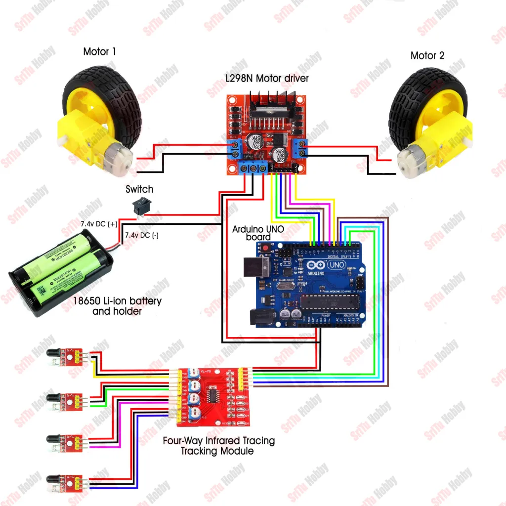

# **Line-Following Robot**

A simple and efficient line-following robot designed using Arduino Uno, IR sensors, and motor drivers. This project demonstrates the integration of hardware and software to create a robot capable of autonomously following a predefined path.

---

## **Features**
- **Autonomous Navigation:** Follows black lines on a white surface using IR sensors.
- **Sensor Calibration:** Optimized for accurate path detection and smooth turns.
- **Hardware Integration:** Utilizes Arduino Uno, L298N motor driver, and BO motors for precise control.
- **Cost-Effective:** Built with readily available and affordable components.

---

## **Hardware Components**
- **Arduino Uno** (Microcontroller board)
- **L298N Motor Driver** (For motor control)
- **IR Sensors** (5 units for line detection)
- **BO Motors** (2 DC motors for movement)
- **Chassis** (Robot frame)
- **Wheels** (2 standard wheels with 1 caster wheel for support)
- **Power Supply** (6V or 9V battery)

---

## **Software and Libraries**
- **Programming Language:** Arduino (C/C++)
- **IDE:** Arduino IDE
- **Libraries Used:**  
  - No additional libraries are required for basic functionality.

---

## **Circuit Diagram**
  
*(Replace this with the actual image link in your repository.)*

---

## **Setup Instructions**
1. **Hardware Assembly:**
   - Connect the IR sensors to the analog pins of the Arduino Uno.
   - Wire the L298N motor driver to control the BO motors.
   - Assemble the chassis, mount the components, and connect the battery.

2. **Software Upload:**
   - Install the Arduino IDE from [Arduino's official site](https://www.arduino.cc/en/software).
   - Download the code file (`main.ino`) from this repository.
   - Connect the Arduino Uno to your computer via USB.
   - Open the code file in the Arduino IDE and upload it to the Arduino board.

3. **Calibration:**
   - Test the IR sensors to ensure they correctly detect the line.
   - Adjust the threshold values in the code if necessary.

4. **Testing:**
   - Place the robot on a track with a black line on a white surface.
   - Power it on and observe its movement.

---

## **Future Improvements**
- Implement obstacle detection using ultrasonic sensors.
- Add Bluetooth/Wi-Fi control for remote operation.
- Optimize the algorithm for faster and smoother navigation.

---

## **Contact**
For any queries or suggestions, feel free to reach out:  
- **Email:** nandans123456321@gmail.com  
- **LinkedIn:** https://www.linkedin.com/in/nandan-s-9279952a1/

---

